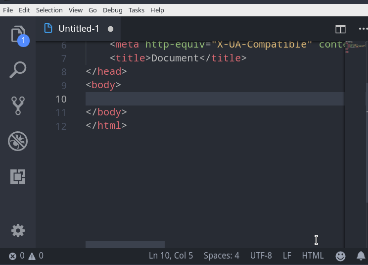

# DLE-snippets

This extension contains Datalife Engine code snippets (Template tags) for VScode edior.

## Installation

Simply open Extensions tab (`Ctrl+Shift+X`) in VScode and search for `dle-snippet` and install it.

